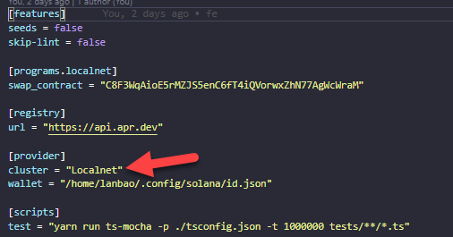

# Interview Remitano


### Folder structure

```bash
├── fe
│   ├── config
│   ├── public
│   ├── src
│   │   ├── components
│   │   ├── hooks
│   │   ├── pages
│   │   ├── scss
│   │   ├── store
│   │   ├── App.tsx
│   │   ├── idl.json (smart contract interface)
│   │   └── index.tsx
│   └── package.json
├── smart-contract
│   ├── programs
│   │   ├── swap_contract
│   │   │    └── src
│   │   │       └── lib.rs  (smart contract)
│   ├── test
│   │   └── swap_contract.ts (unit test)
│   └── Anchor.toml (configuration for deployment)
└── README.md
```

### 👩‍💻Smart contract:
This demo implemented on Window machine, so I only introduce setup for window
#### 🔥Setting up Solana on a Windows machine:
1. Open cmd.exe to setup wsl
```bash
wsl --install
```
2. Install nodejs 
```bash
// Install Curl
sudo apt-get install curl

// Install NVM
curl -o- https://raw.githubusercontent.com/nvm-sh/nvm/v0.38.0/install.sh | bash

// Restart Ubuntu Terminal

// Test if nvm exists - this will return "nvm" and not a version number if working correctly!
command -v nvm

// Install the latest version of Node.js
nvm install --lts

```
3. Install Rust 
```bash
curl --proto '=https' --tlsv1.2 https://sh.rustup.rs -sSf | sh
```
4. Install Solana

The installation steps are pretty straight forward [here](https://docs.solana.com/cli/install-solana-cli-tools#use-solanas-install-tool). 

> Setup Solana localhost enviroment for Unit Test
>```bash
> solana config set --url localhost
>```

#### 🔥Run Unit Test:
Open ubuntu terminate and use command line below:
```bash
cd smart_contract
anchor test
```
#### 🔥Build and deploy:
In this Readme, I will introduce deploy to localhost. If you looking for testnet or devnet, you can swith to them by change the Anchor.toml:




```bash
cd smart_contract
anchor build
anchor deploy
```
### 👩 Fontend:
CICD for this repo already setup with [Vercel.com](https://vercel.com/), you can try with live [demo](https://solana-it-remi.vercel.app/)

#### 🚀 Run Fontend on localhsot (PORT 3011):
```bash
cd fe
npm install
npm start
```

